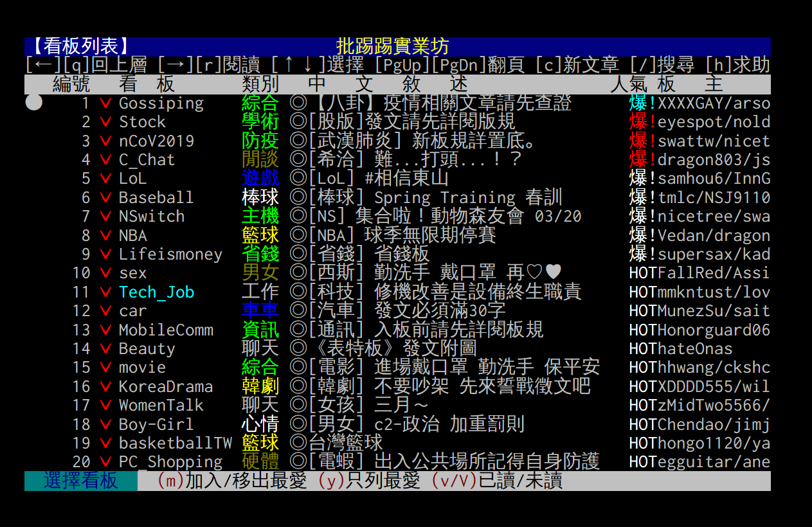
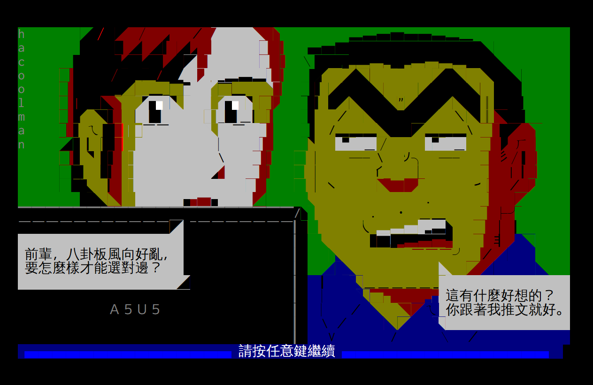
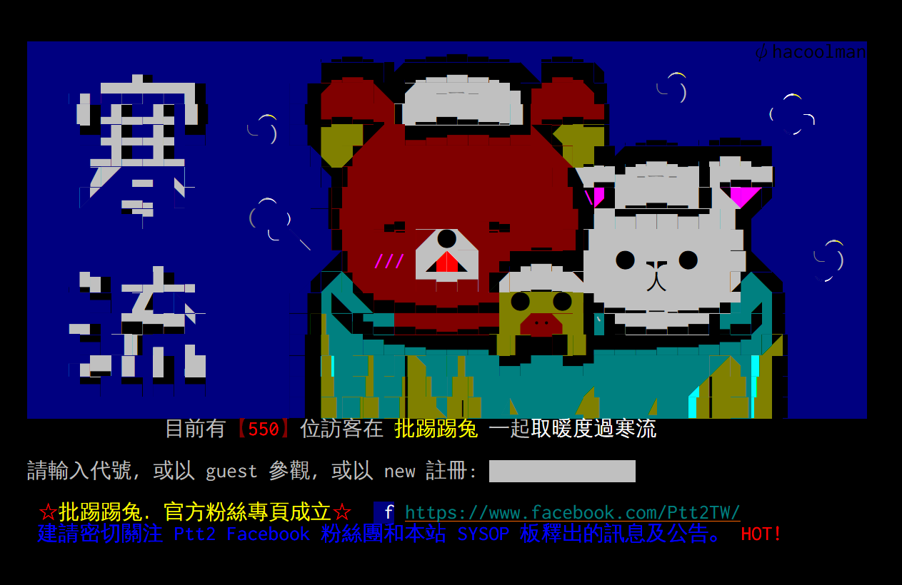
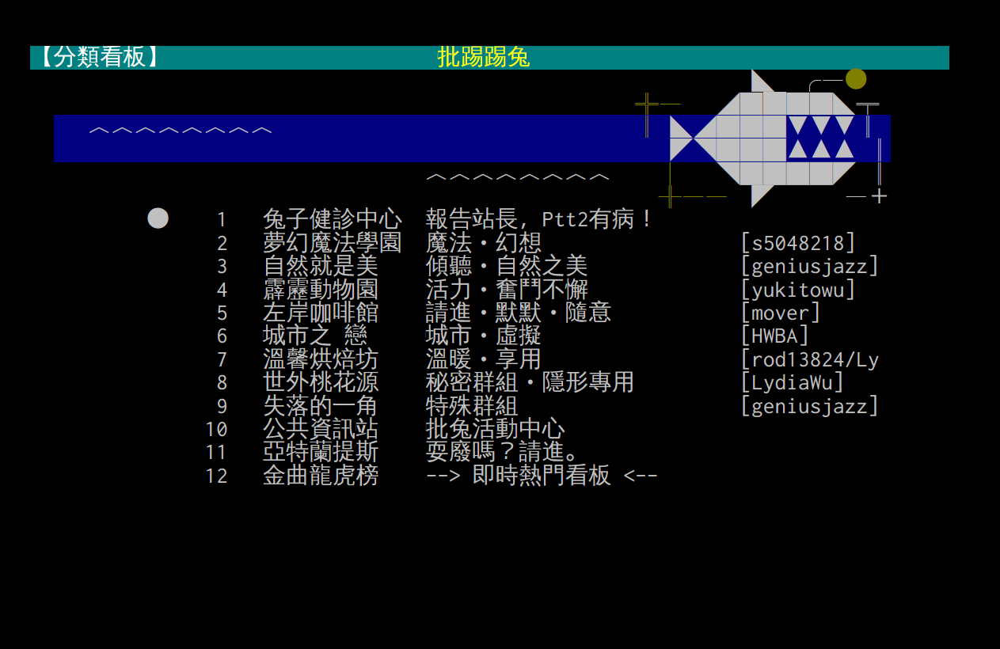

# SymMingLiU4WenQ
Subset font containing symbols in MingLiU with better fallback to WenQuanYi Zen Hei Mono for BBS browsers.

SymMingLiU was first created by [iamchucky/PttChrome](https://github.com/iamchucky/PttChrome).

## Screenshots

